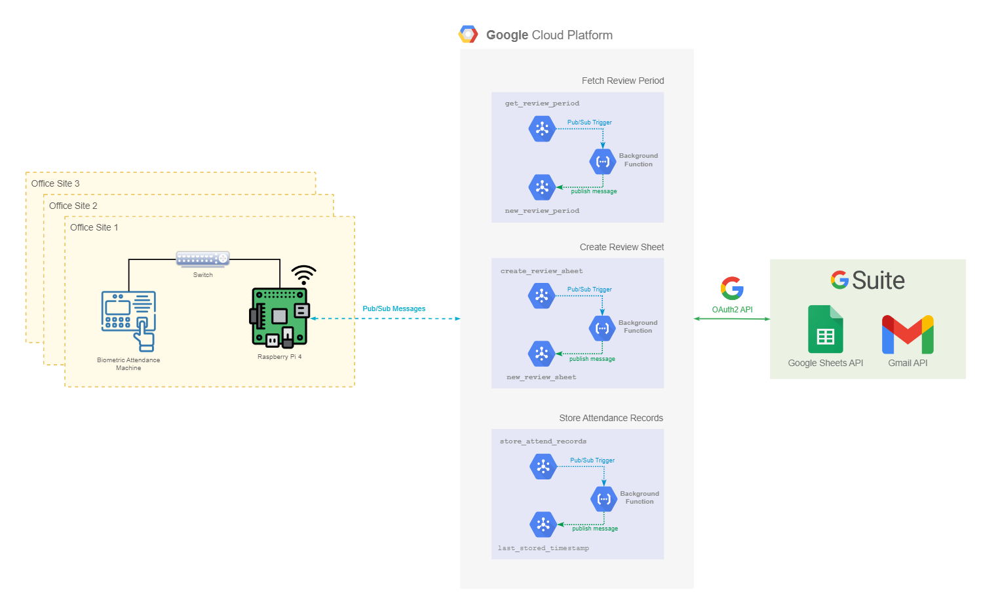
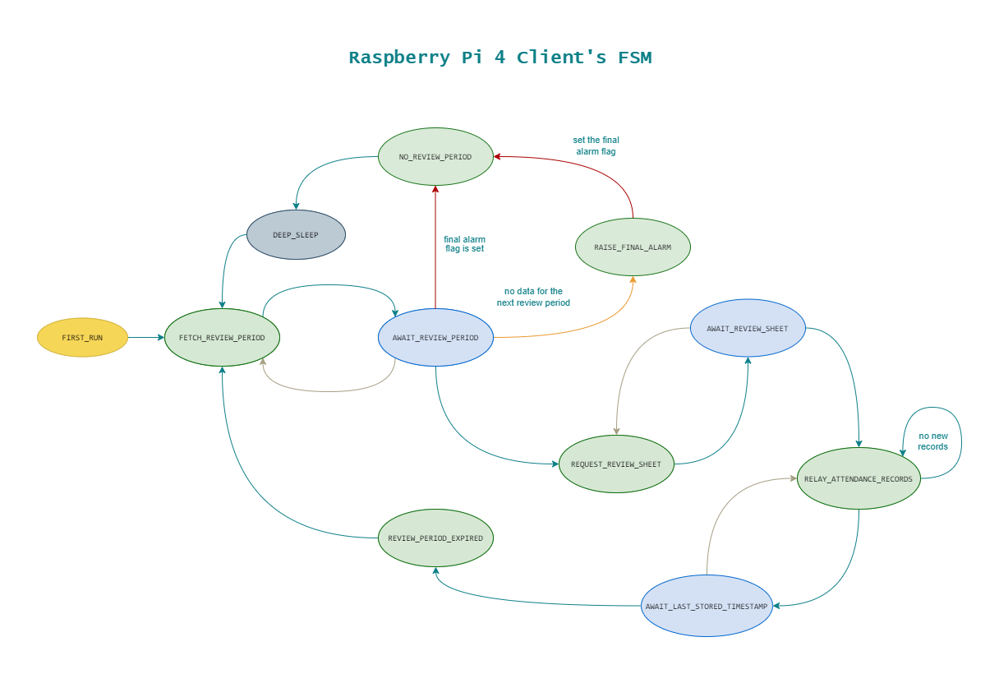

# Attendance Automation

A project to automate the process of retrieving the clock-in and clock-out information of employees from a ZKTeco Tx628 biometric attendance machine. The main motivation behind this project was to facilitate the HR personnel with the month end Attendance Reviews.

## High Level Architecture



The solution leverages a pull-push mechanism to fetch the attendance data from the biometric device and push it to the serverless backend via a "publish-subscribe" communication model. The serverless backend saves the data in a central data-store.   

### Frontend

- The frontend leverages a standalone Python script running on a Raspberry Pi4 device.
- The Raspberry Pi4 device is interfaced with the ZKTeco biometric device via an ethernet connection.
- The ZKTeco biometric attendance machines host an embedded TCP server from the manufacturer which allows pulling the attendance data from the device.

### Backend

- The GCP hosted serverless backend leverages Google Pub/Sub and Google Cloud Functions for handling client requests.
- The attendance data received from each frontend node is aggregated and stored in the monthly attendance review Google Sheet (used by the HR).
- All communication between the Google Cloud Functions and Google Sheets is done via Google's OAuth2 API.


## Raspberry Pi 4 Client

### How it works

The Python script running on the Raspberry Pi 4 implements the Finite State Machine in the diagram below.



#### Color Coding
- The green nodes denote states where the a snapshot of the current state is captured and stored on disk.
- The blue nodes denote states where the Raspberry Pi 4 client is waiting for the data from the backend.
- The gray arrows represent state transitions in case of a timeout or power failure.
- The orange arrow represents a state transition due to missing information in the data-store. This state transition requires raising an alarm.
- The red arrows represent state transitions that will cause the Raspberry Pi 4 client to enter a deep sleep.

### Configuration Files

The Pi 4 client script requires the following configuration files to be present in the same directory as the Python script.

#### biometeric_device_config.json

```json
{
    "identifier": "<id_to_denote_office_site>",
    "ip": "<ipv4_address_of_zkteko_machine>",
    "port": <zkteco_machine_tcp_server_port_number>
}

```

**Warning:** The `json` snippet above only defines the template of the configuration file. Be sure to replace the placeholders (i.e. `<help_text_for_expected_value>`) with actual values!  


#### snapshot.json

```json
{
    "pi4_state": 1,
    "sys_flags": 0,
    "sheet_id": null,
    "last_stored_timestamp": null
}
```
