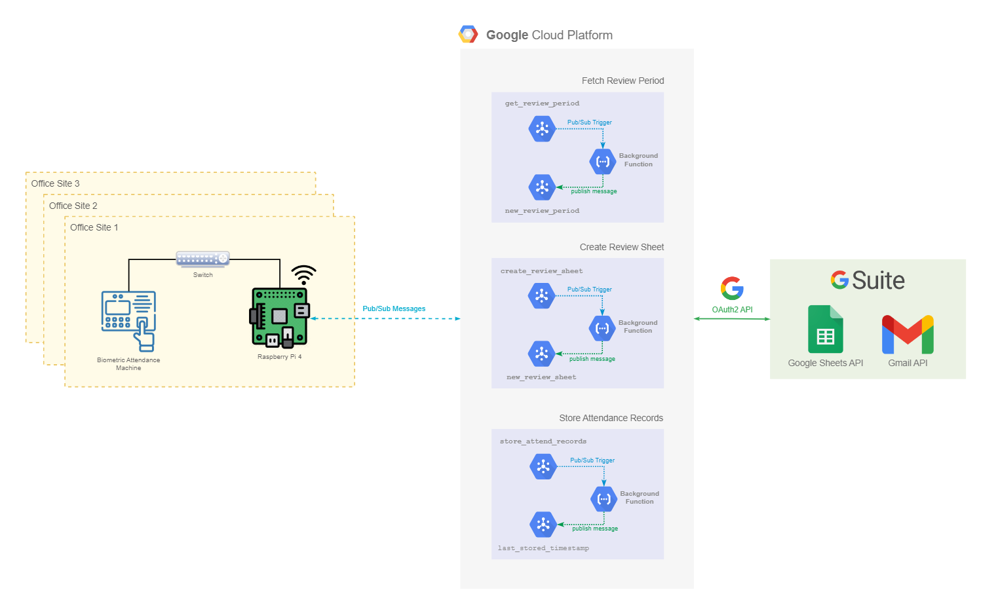
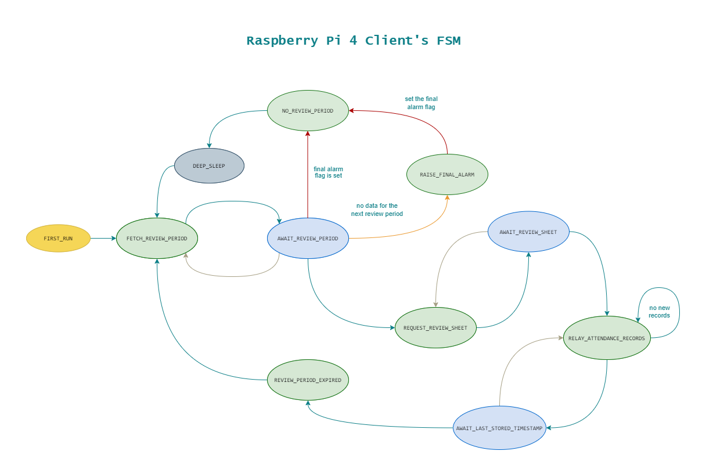

# Attendance Automation

Attendance Automation is an ETL-oriented Python project for collecting attendance records from a ZKTeco
biometric device, moving them through Google Pub/Sub and Google Cloud Functions, and preparing Google Sheets
output for HR attendance review.

[](https://github.com/aitzaz-ahmad/attendance-automation/actions/workflows/ci.yml)

## Problem Statement

Month-end attendance review is a manual, repetitive process for HR teams. Attendance records need to be
extracted from biometric devices, checked against the relevant review period, prepared in a usable format,
and stored where reviewers can work with them.

This repository automates the collection and preparation path for attendance records from a ZKTeco
biometric attendance device. The current implementation is not presented as a finished production platform;
it is a structured ETL codebase and migration target for making the original attendance workflow easier to
run, validate, and evolve.

## System Overview

The system is organized around the canonical Python package namespace `attendance_etl`, with ingestion
logic under `attendance_etl.ingestion` and Google Cloud Function logic under `attendance_etl.functions`.

At a high level, the ingestion client extracts records from a ZKTeco biometric device, filters and decodes
the device data, and publishes work through Google Pub/Sub. Google Cloud Functions process review period,
review sheet, and attendance record messages. Google Sheets remains the storage and review output used by HR.

The legacy Raspberry Pi 4 execution path is preserved as a compatibility wrapper at `src/pi4/pi4_client.py`.
That wrapper delegates to `attendance_etl.ingestion.client`, which keeps the current device-oriented workflow
runnable while the package moves toward more hardware-neutral ingestion terminology and boundaries.

## Architecture Diagram



For the canonical system architecture, including the Mermaid topology diagram, component boundaries, and
current limitations, see [Architecture](docs/architecture.md).

## Data Pipeline

The intended data flow is:

```text
Extract -> Transform/Canonicalise -> Publish -> Process -> Store/Review
```

For the ordered stage-by-stage pipeline, including current implementation paths and known limitations, see
[Data Pipeline](docs/data-pipeline.md).

## Reliability Mechanisms

The ingestion workflow uses a finite state machine with checkpoint persistence, timeout-aware Pub/Sub waits,
and retry/sleep paths for missing review metadata. The model is designed to let the compatibility Pi client
resume from the last checkpointed non-waiting state after interruption without claiming exactly-once delivery
or transactional recovery.



For the detailed recovery model, see [Reliability Model](docs/reliability.md).

## Current Implementation

The repository currently contains:

- A Python `src/` layout with the canonical package namespace `attendance_etl`.
- Ingestion code at `src/attendance_etl/ingestion/client.py`.
- Google Cloud Function implementation modules under `src/attendance_etl/functions/`.
- Google Cloud Function deployment wrappers under `src/backend/*/main.py`.
- A Raspberry Pi compatibility entry point at `src/pi4/pi4_client.py`.
- Static quality tooling configured through `pyproject.toml` for Ruff, Black, and MyPy.
- A GitHub Actions CI workflow at `.github/workflows/ci.yml` that runs lint, format, and type gates.
- A test directory scaffold under `tests/`; project pytest execution is still pending in the validation
  workflow.

## Future Roadmap

Near-term work should stay focused on making the existing ETL system easier to reason about, test, and
extend:

- Adopt the canonical attendance event schema across transformation and downstream processing.
- Document architecture and data contracts.
- Add focused tests around ingestion and function behavior.
- Isolate the transformation layer.
- Introduce a device abstraction around biometric attendance extraction.
- Introduce messaging and storage abstractions around Pub/Sub and Google Sheets boundaries.
- Isolate reliability and finite state machine behavior for testability.
- Continue repository and portfolio documentation polish.

## Contributing

For setup, dependency installation, validation commands, and contribution workflow, see:

- [Local Development](docs/workflows/local-development.md)

Key repository references:

- [Agent operating instructions](AGENTS.md)
- [Documentation index](docs/README.md)
- [Architecture](docs/architecture.md)
- [Data pipeline](docs/data-pipeline.md)
- [Reliability model](docs/reliability.md)
- [Canonical attendance event contract](docs/contracts/canonical-attendance-event.md)
- [CI workflow](.github/workflows/ci.yml)
