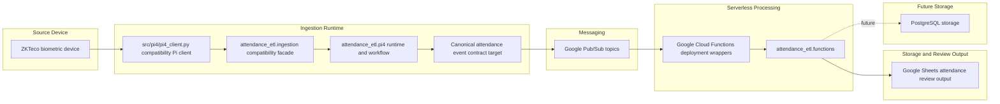
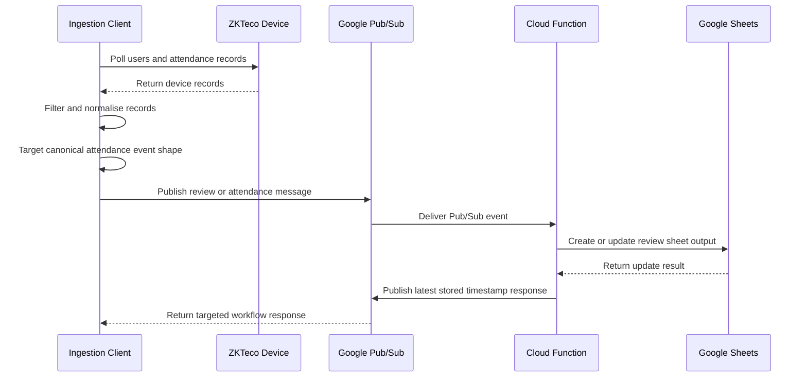

# Architecture

## System Overview

Attendance Automation is an ETL-oriented attendance pipeline for moving records from a ZKTeco biometric
device into reviewer-facing Google Sheets output.

The repository is currently a structured migration target rather than a completed production platform. The
implemented path is device-oriented and Google Sheets-backed, while the documented canonical attendance event
contract defines the target internal record shape for future transformation work.

## Architecture Diagram

The current Mermaid system flow shows the source device, ingestion runtime, canonical event target, Pub/Sub
messaging, Cloud Function processing, Google Sheets output, and future PostgreSQL storage boundary.



The README also includes a high-level [architecture diagram](diagrams/high-level-architecture.png). The ingestion reliability [state machine](diagrams/pi4-client-fsm.png) is documented separately and summarized in
[Reliability Model](reliability.md).

## Component Model

### Biometric Source Device

The source system is a ZKTeco biometric attendance device. The current ingestion code connects to the device,
reads users and attendance records, and decodes device-specific fields before publishing downstream work.

### Ingestion Runtime And Pi Compatibility Client

The legacy Raspberry Pi 4 execution path remains available at `src/pi4/pi4_client.py`. It is a compatibility
entry point that delegates to the `attendance_etl.ingestion.client` compatibility facade. The facade delegates
to `attendance_etl.pi4.runtime`, preserving the current runnable device workflow while the project moves
toward more explicit ingestion boundaries.

### `attendance_etl.ingestion`

`src/attendance_etl/ingestion/client.py` is the compatibility facade for existing callers. It preserves
`attendance_etl.ingestion.client.main()` and delegates runtime execution to `attendance_etl.pi4.runtime`.

### Ingestion Support Modules

The Raspberry Pi ingestion client is split into focused package modules:

- `attendance_etl.device.zkteco` owns ZKTeco connection lifecycle, device reads, and attendance clearing.
- `attendance_etl.transform.zkteco_records` owns current ZKTeco user mapping, filtering, and transitional
  record decoding.
- `attendance_etl.models` owns lightweight dataclass representations for core domain contracts such as
  attendance events, employees, review periods, and persisted runtime state.
- `attendance_etl.config` owns shared runtime configuration constants such as Pub/Sub names, local runtime
  files, polling intervals, and device connection defaults.
- `attendance_etl.messaging.pubsub` owns Pub/Sub publication, subscriptions, targeted pulls, ACKs, and message
  decoding.
- `attendance_etl.storage.snapshot` and `attendance_etl.storage.review_period` own the existing JSON files.
- `attendance_etl.pi4.state`, `attendance_etl.pi4.workflow`, and `attendance_etl.pi4.runtime` own Pi state,
  finite-state-machine behavior, and runtime composition.
- `attendance_etl.logging_utils` owns shared logging setup and responsibility-oriented logger acquisition.

The ingestion runtime currently publishes transitional attendance dictionaries. Runtime enforcement of the
canonical attendance event contract is future work.

### Canonical Attendance Event Contract

The target internal attendance payload is documented in
[Canonical Attendance Event](contracts/canonical-attendance-event.md). It defines fields such as
`event_id`, `source_device_id`, `employee_id`, `event_timestamp`, `event_type`, and `ingested_at`.

This contract is an architecture target for transformation and downstream processing. Current runtime
publishing has not fully adopted or validated this schema end to end.

### Google Pub/Sub Messaging

Google Pub/Sub is the handoff boundary between the ingestion runtime and serverless backend. The ingestion
workflow publishes JSON messages for review-period lookup, review-sheet creation, and attendance-record
storage. Cloud Functions consume the corresponding Pub/Sub events and return workflow responses where needed,
including the latest stored attendance timestamp.

### Cloud Function Deployment Wrappers

The deployable Google Cloud Function entry points live under `src/backend/*/main.py`. These wrappers provide
the per-function deployment shape and delegate implementation work to package modules under
`attendance_etl.functions`.

Each backend function currently carries its own deployment dependencies. Shared dependency isolation across
functions remains a current deployment constraint.

### `attendance_etl.functions`

`src/attendance_etl/functions/` contains the canonical Python implementation modules for serverless behavior.
Current modules process review-period lookup, review-sheet creation, and attendance-record storage workflows.

These modules parse the expected Pub/Sub payloads and interact with Google APIs. They do not yet enforce the
canonical attendance event contract as a runtime schema.

### Google Sheets Review Output

Google Sheets is the current implemented persistence and HR review surface. The storage workflow appends raw
attendance records, updates daily attendance data, updates weekly summary data, and returns the latest stored
timestamp used by ingestion to avoid resending already-persisted records.

### Future PostgreSQL Storage

PostgreSQL appears only as future storage in the architecture diagram and roadmap. It is not part of the
current implemented persistence path.

## Sequence View

The simplified sequence below shows the intended flow without claiming that every boundary already enforces
the final canonical contract at runtime.



## Codebase Structure

```text
src/
├── attendance_etl/
│   ├── device/        # ZKTeco device interaction
│   ├── transform/     # Source-specific record transformation
│   ├── messaging/     # Pub/Sub integration helpers
│   ├── storage/       # Local JSON persistence helpers
│   ├── pi4/           # Pi runtime, state, and workflow
│   ├── ingestion/     # Compatibility facade for existing ingestion callers
│   └── functions/     # Reusable Cloud Function implementation modules
├── backend/           # Google Cloud Function deployment entry points
└── pi4/               # Raspberry Pi compatibility runtime

docs/                  # Architecture, contracts, workflows, diagrams
tests/                 # Unit/integration test scaffold
```

The important boundary is between deployment wrappers and canonical package modules. `src/backend/*/main.py`
files are deployment entry points; reusable implementation should live under `src/attendance_etl/`.

## Architecture Boundaries And Current Limitations

- Runtime canonical attendance event enforcement is future work.
- Current attendance payloads still use transitional dictionaries in parts of the ingestion and storage path.
- Google Cloud Function dependencies remain organized per function under `src/backend/*/requirements.txt`.
- Google Sheets is the current implemented persistence and review output.
- PostgreSQL is documented as future storage only.
- The reliability and finite state machine behavior is implemented under `attendance_etl.pi4`.
- The source extraction path remains ZKTeco-specific.

## Related Documents

- [README](../README.md)
- [Data Pipeline](data-pipeline.md)
- [Canonical Attendance Event](contracts/canonical-attendance-event.md)
- [Reliability Model](reliability.md)
