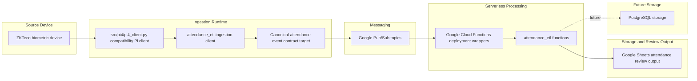

# System Architecture

This Mermaid diagram shows the current attendance automation system flow from biometric device extraction
through Pub/Sub-backed serverless processing and Google Sheets review output.

